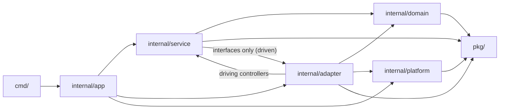

# Architecture

This document captures the layered, hex-flavoured layout the codebase uses
after the Phase A–F refactor. It is the source of truth for "where does
this piece of code go?" Read it before adding a new package.

## Goals

- Make the dependency direction obvious by reading the import graph.
- Keep the domain pure Go: no infra, no transport, no global mutable state.
- Concentrate every external dependency at a single boundary so swapping
  Postgres for SQLite, NATS for Kafka, etc. is a one-package change.
- Enforce the rules with `golangci-lint` (`depguard`) so the layout cannot
  silently rot under future PRs.

## Layout

```
cmd/
  core-api/  gateway/  engine/  worker/  ai-bot/   dedicated service binaries
  supremacy/                           multi-mode binary (local dev only)
internal/
  platform/bootstrap/                shared process startup (config, metrics, signals)
  app/                               composition root, one file per binary mode
  platform/                          cross-cutting infra (no domain knowledge)
    log/    metrics/    health/    httpserver/
  domain/                            pure Go, no infra imports
    ids/                             typed primitives (MatchID, SlotID, …)
    timeline/                        event heap (engine timeline scheduler)
    matchdom/                        Match aggregate + simulation
    unitdom/                         Unit Kind interface + concretes
    buildingdom/                     Building Kind interface + concretes
    economydom/                      Resources value object
    visibility/                      visibility / fog-of-war
    balance/                         tunable game constants
    cmddom/                          Command + Handler registry
    userdom/                         User account record
    lobbydom/                        Lobby/match persistence record
  service/                           use-case orchestrators
    authsvc/                         register / login / ws-tickets
    lobbysvc/                        create / join / start / list
    enginesvc/                       runner / dispatcher / broadcaster
  adapter/                           drivers/driven adapters
    httpapi/v1                       chi controllers (driving adapters)
    httpapi/{mw,render}              middleware + response helpers
    natsbridge/                      NATS streams + payloads
    pgrepo/                          Postgres repositories
    redisrepo/                       Redis-backed slot index, ticket store
  engine/  gateway/  worker/         binary-mode composition roots
  auth/                              JWT, password, ticket primitives
  config/                            typed config loader
  storage/                           connection helpers + migrations
pkg/                                 importable from outside the repo
  api/                               public REST DTOs
  errs/                              error catalogue + HTTP status mapping
  shared/maps/                       YAML map loader
  shared/wire/                       WebSocket envelope
```

## Dependency rule



The strict rules are:

| from \\ to        | domain | service | adapter         | platform | pkg | binary modes |
| ----------------- | ------ | ------- | --------------- | -------- | --- | ------------ |
| `domain/`         | yes    | no      | no              | no       | yes | no           |
| `service/`        | yes    | yes     | no (interfaces) | yes      | yes | no           |
| `adapter/` driven | yes    | no      | yes             | yes      | yes | no           |
| `adapter/httpapi` | yes    | yes     | yes             | yes      | yes | no           |
| `platform/`       | no     | no      | no              | yes      | yes | no           |
| `app/`            | yes    | yes     | yes             | yes      | yes | yes          |
| `pkg/`            | no     | no      | no              | no       | yes | no           |

These are enforced by `depguard` in `.golangci.yml`. A violating import is a
build break.

### Why does `httpapi` get an exception?

Driving adapters (HTTP controllers) exist solely to call into services.
We could express this as inbound ports declared in the service package,
but for an indie codebase the indirection is not worth the boilerplate.
The compromise: only `internal/adapter/httpapi/**` may import services.
`pgrepo`, `redisrepo` and `natsbridge` may not.

## Where does new code go?

A short decision tree:

1. **Pure game logic, no infra, deterministic?** → `internal/domain/<area>dom/`
   - Tied to a single noun? Make a new package. Tied to multiple? Extend
     the closest existing one.
2. **Coordinating multiple domain pieces, calling adapters?** →
   `internal/service/<area>svc/`
   - Declare your dependencies as interfaces in this package. The adapter
     will fulfil them.
3. **Talks to an external system (DB, queue, REST, gRPC)?** →
   `internal/adapter/<system>/`
   - Driven adapters: implement an interface declared in the consuming
     service. Driving adapters: HTTP controllers go in
     `internal/adapter/httpapi/v1/`.
4. **Cross-cutting infra (logging, metrics, health, generic HTTP)?** →
   `internal/platform/<area>/`
5. **Public REST DTO or shared wire format?** → `pkg/api/` or `pkg/shared/`.
6. **Wiring two of the above into a binary?** →
   `internal/app/<mode>.go`. Each binary mode has a single composition
   file.

If you cannot decide, ask in an ADR.

## File-size and complexity budgets

Enforced by `golangci-lint` (`funlen`, `gocyclo`, `lll`):

- Files: soft cap 300 LOC, hard fail at 500.
- Functions: cap 80 lines / 50 statements / cyclomatic 15.
- Lines: 140 columns.
- React components: cap 200 LOC; hooks live in their own files.

When a budget breaks, **the fix is to split, not to bump the limit**.

## Patterns we lean on

- **Strategy** for [`unitdom.Kind`](internal/domain/unitdom/kind.go) and
  [`buildingdom.Kind`](internal/domain/buildingdom/kind.go). Adding a unit
  is one new file plus one map entry.
- **Command** for
  [`cmddom.Handler`](internal/domain/cmddom/handler.go) and
  [`cmddom.Dispatch`](internal/domain/cmddom/registry.go). Adding a Phase
  4 `declare_war` is one new file + one `init()` registration.
- **Repository** for [`pgrepo.Users`](internal/adapter/pgrepo/users.go)
  and [`pgrepo.Matches`](internal/adapter/pgrepo/matches.go). Service
  consumers declare the interfaces they need.
- **Adapter** at every external boundary. The adapter package is the
  only file that imports the SDK.
- **Composition root** in [`internal/app/`](internal/app/). Each mode's
  `Run()` is small and grep-able.
- **Mapper** between domain and wire types. See
  [`internal/adapter/httpapi/v1/mapper.go`](internal/adapter/httpapi/v1/mapper.go)
  for the lobby example.

## ADRs

Architectural decision records live in [`docs/adr/`](docs/adr/). The
template is [`docs/adr/template.md`](docs/adr/template.md). Add a new ADR
whenever a Phase introduces a new pattern, swaps a dependency or relaxes
a layering rule.
