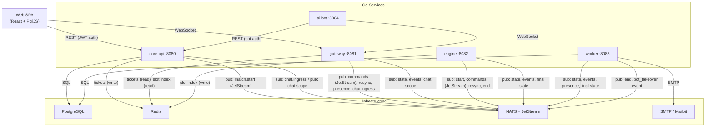

# Clone Supremacy — Architecture

Clone Supremacy is a persistent-world RTS game backend built as five cooperating Go services. Services communicate primarily through NATS (with JetStream for durability), use PostgreSQL for all persistent state, and Redis for short-lived ephemeral data. A React + PixiJS SPA connects to the system via REST and WebSocket.

---

## Binaries

### core-api (`:8080`)

The primary HTTP service. It handles user registration and login (JWT issuance), the match lobby lifecycle (create, join, start, leave, kick), WebSocket ticket minting, chat persistence, and user notifications. It also runs database schema migrations at startup.

**Connects to:** PostgreSQL, Redis, NATS

### gateway (`:8081`)

The WebSocket edge server. Clients connect here for real-time bidirectional communication during matches. It validates connections using single-use tickets stored in Redis, resolves each user's player slot from Redis, and bridges between WebSocket clients and the NATS message bus — forwarding commands inbound and relaying state and events outbound.

**Connects to:** Redis, NATS

### engine (`:8082`)

The match simulation loop. It subscribes to match-start and player-command events from NATS JetStream, runs the in-memory RTS game logic, and broadcasts updated game state and events back to NATS for the gateway to relay. It also writes the player slot index to Redis at match start so the gateway can perform per-slot filtering.

**Connects to:** Redis, NATS

### worker (`:8083`)

A collection of background jobs running concurrently:

- **SnapshotWorker** — periodically persists match state to PostgreSQL.
- **PresenceWorker** — tracks player last-seen timestamps; triggers AI takeover when a player has been idle beyond the threshold.
- **FinalStateWorker** — persists the definitive match result and stats when a match ends.
- **AbandonWorker** — detects matches where all human players have gone silent and forces them to end.
- **NotifyWorker** — processes the notification queue and dispatches emails via SMTP.

**Connects to:** PostgreSQL, NATS, SMTP

### ai-bot (`:8084`)

Spawns headless bot players. When the worker detects an idle human player and flips a slot to AI control, the ai-bot service authenticates a bot identity through core-api's bot-auth endpoint and opens a WebSocket session to the gateway, issuing game commands as a normal client would.

**Connects to:** PostgreSQL (match data), core-api (REST), gateway (WebSocket)

### supremacy (dev-only)

A convenience binary that accepts a `--mode` flag (or `SUPREMACY_MODE` env var) and dispatches to any of the five service runners above. Intended for local development and integration tests only; production deployments use the dedicated per-service binaries.

---

## Infrastructure Dependencies

| Dependency | Version | Role |
|---|---|---|
| PostgreSQL | 16 | Persistent storage: users, matches, chat, notifications, stats, snapshots. Migrations are applied by core-api at startup. |
| Redis | 7 | Ephemeral state: WebSocket tickets (30 s TTL) and the player slot index (24 h TTL). |
| NATS + JetStream | 2.10 | Event-driven inter-service messaging. See [`docs/nats-topics.md`](../nats-topics.md) for the full subject reference. |
| SMTP / Mailpit | — | Outbound email notifications, dispatched by worker. Mailpit is used in local development. |

Every binary exposes a Prometheus metrics endpoint on a configurable port (default `:910x`) and standard health probes (`/healthz`, `/readyz`).

---

## System Interaction Diagram

---

## Key Communication Flows

### Match lifecycle

A player creates and starts a match through core-api's lobby endpoints. On start, core-api publishes a start event to the engine via NATS JetStream. The engine materialises the match in memory, writes the slot index to Redis, and immediately begins broadcasting the initial game state to NATS for connected clients to receive.

### Player commands

A client sends a command over its WebSocket connection to the gateway. The gateway publishes it to NATS JetStream. The engine's durable consumer picks it up, applies the command to the in-memory match state, and broadcasts updated per-slot state and events back through NATS. The gateway relays the appropriate filtered state to each connected client.

### Chat

A client sends a chat message over WebSocket to the gateway. The gateway forwards it to core-api via NATS. Core-api validates and persists the message to PostgreSQL, then fans it out to the relevant scope subjects on NATS. The gateway's per-connection chat subscriptions relay the message to the correct clients.

### Presence and AI takeover

When a client opens a match WebSocket session, the gateway publishes a presence signal on NATS. The worker's PresenceWorker records the player's last-seen timestamp in PostgreSQL. On a periodic scan, if a player has been idle beyond the configured threshold, the worker flips the slot to AI control in the database and publishes a `bot_takeover` event. The ai-bot service sees the open slot, authenticates through core-api, and connects to the gateway as a normal WebSocket client.

### Match abandonment

The worker's AbandonWorker periodically scans for matches where all alive human players have been silent beyond the abandonment threshold. When detected, it marks the match as abandoned in PostgreSQL and publishes an end signal to NATS. The engine receives it, force-terminates the match, and publishes a final-state snapshot. The worker's FinalStateWorker persists the snapshot and projects match statistics.

---

## Further Reading

- [`docs/nats-topics.md`](../nats-topics.md) — full NATS subject reference, JetStream vs. core NATS breakdown, and payload types.
- [`docs/adr/`](../adr/) — architectural decision records explaining key design choices.
- [`docs/how-to-run-locally.md`](../how-to-run-locally.md) — instructions for running the full stack locally.
