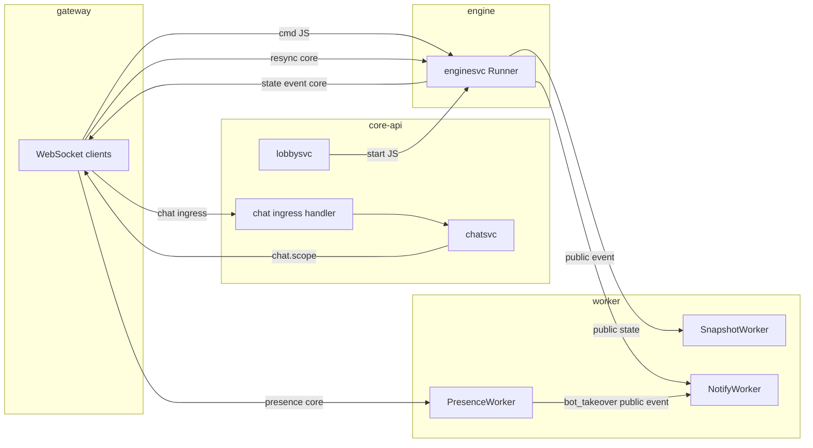

# NATS topics reference

This document lists every NATS subject pattern used by clone-supremacy, what carries each message (core NATS vs JetStream), who publishes, and who consumes. Canonical subject helpers and stream config live in [`internal/adapter/natsbridge/`](../internal/adapter/natsbridge/).

Each service has its own binary under `cmd/<service>/` (see
[ADR 0007](adr/0007-multi-binary-layout.md)). Processes that touch NATS are:

- **core-api** — lobby start notifications, chat ingress subscription, chat fan-out after Postgres write
- **gateway** — WebSocket clients: commands, resync, state/event subscriptions, presence, chat ingress
- **engine** — JetStream stream creation, match hosting, state/event publishing
- **worker** — snapshot persistence, presence ingestion, notifications from public events

Local dev may still use `go run ./cmd/supremacy <mode>`; production Compose
invokes `/usr/local/bin/<service>` directly.

---

## JetStream vs core NATS

| Mechanism | Subjects | Notes |
|-----------|----------|--------|
| **JetStream** | `match.<matchID>.cmd`, `match.<matchID>.start` | Stored in stream **`supremacy-cmd`** ([`streams.go`](../internal/adapter/natsbridge/streams.go)), configured with subjects `match.*.cmd` and `match.*.start` ([`subjects.go`](../internal/adapter/natsbridge/subjects.go)). **`EnsureStreams`** runs on **engine** startup only ([`internal/engine/server.go`](../internal/engine/server.go)). Gateway/core-api publish with `jetstream.JetStream.Publish` ([`publisher.go`](../internal/adapter/natsbridge/publisher.go)). The stream must exist before those publishes succeed in production (start engine first, or create the stream out-of-band). |
| **Core NATS** | resync, state, event, presence, chat | `nats.Conn.Publish` / `Subscribe` only; no JetStream persistence in these code paths. |

---

## Match subjects

| Subject pattern | Transport | Publisher(s) | Consumer(s) | Notes |
|-----------------|-----------|--------------|-------------|--------|
| `match.<id>.cmd` | JetStream (`match.*.cmd`) | **Gateway** — [`internal/gateway/hub.go`](../internal/gateway/hub.go) (`PublishCommand`) | **Engine** — durable consumer `engine-worker` on stream `supremacy-cmd` ([`subscriber.go`](../internal/adapter/natsbridge/subscriber.go)) | Handler forwards to `enginesvc.Runner.Submit`. Returns [`natsbridge.ErrNotHosted`](../internal/adapter/natsbridge/subscriber.go) → NAK with delay so another engine can retry. Payload: [`CommandPayload`](../internal/adapter/natsbridge/payloads.go). |
| `match.<id>.start` | JetStream (`match.*.start`) | **Core-api / lobbysvc** — when a match starts ([`internal/service/lobbysvc/service.go`](../internal/service/lobbysvc/service.go) → `PublishStart`) | **Engine** — durable consumer `engine-starter` ([`subscriber.go`](../internal/adapter/natsbridge/subscriber.go)) | Same stream as commands. Payload: [`StartPayload`](../internal/adapter/natsbridge/payloads.go). |
| `match.<id>.resync` | Core | **Gateway** — [`hub.go`](../internal/gateway/hub.go) (`PublishResync`) | **Engine** — wildcard `match.*.resync` ([`subscriber.go`](../internal/adapter/natsbridge/subscriber.go)) | Triggers `runner.Rebroadcast`. Body: JSON [`ResyncPayload`](../internal/adapter/natsbridge/payloads.go). |
| `match.<id>.state` | Core | **Engine** — match loop via [`natsbridge.Publisher`](../internal/adapter/natsbridge/publisher.go) (`PublishPublicState`), wired in [`internal/engine/server.go`](../internal/engine/server.go) | **Gateway** — when no slot in Redis for user (lobby / observer) ([`hub.go`](../internal/gateway/hub.go)); **SnapshotWorker** — subscribes `match.*.state` ([`internal/worker/snapshot.go`](../internal/worker/snapshot.go)) | Public (unfiltered) state envelope. |
| `match.<id>.slot.<slot>.state` | Core | **Engine** (`PublishSlotState`) | **Gateway** — when Redis resolves `user → slot` for the match ([`hub.go`](../internal/gateway/hub.go)) | Per-slot filtered snapshot. |
| `match.<id>.event` | Core | **Engine** (`PublishPublicEvent`); **PresenceWorker** — synthetic `bot_takeover` when AI takeover runs ([`internal/worker/presence.go`](../internal/worker/presence.go)) | **Gateway** (public path); **NotifyWorker** — `match.*.event` ([`internal/worker/notify.go`](../internal/worker/notify.go)) | Notify worker only receives subjects matched by `match.*.event` (see wildcard note below). |
| `match.<id>.slot.<slot>.event` | Core | **Engine** (`PublishSlotEvent`) | **Gateway** — in-match player with resolved slot ([`hub.go`](../internal/gateway/hub.go)) | Per-slot filtered events. |

### Wildcard note (`match.*.state` and `match.*.event`)

In NATS, `*` matches **one** token. So:

- `match.*.state` matches `match.<uuid>.state` only.
- It does **not** match `match.<uuid>.slot.<slot>.state` (extra tokens).

Similarly, `match.*.event` matches public event subjects only, not per-slot event subjects. The engine publishes **both** public and slot copies where needed; workers that need global visibility subscribe to the public patterns.

---

## Presence

| Subject pattern | Transport | Publisher(s) | Consumer(s) | Notes |
|-----------------|-----------|--------------|-------------|--------|
| `match.<id>.presence.<slot>` | Core | **Gateway** — once per match WebSocket session after subscribe ([`hub.go`](../internal/gateway/hub.go) `PublishPresence`) | **PresenceWorker** — `match.*.presence.*` ([`presence.go`](../internal/adapter/natsbridge/presence.go)) | Advisory; not JetStream. Payload: [`PresencePayload`](../internal/adapter/natsbridge/presence.go). |

---

## Chat

| Subject pattern | Transport | Publisher(s) | Consumer(s) | Notes |
|-----------------|-----------|--------------|-------------|--------|
| `chat.<matchID>.ingress` | Core | **Gateway** — user messages from WS ([`internal/gateway/chat.go`](../internal/gateway/chat.go) `PublishChatIngress`) | **Core-api** — `chat.*.ingress` ([`internal/app/coreapi.go`](../internal/app/coreapi.go) `SubscribeChatIngress` → `chatsvc.Send`) | Durability is **Postgres** (chatsvc persists then fan-outs). REST `POST /matches/{id}/chat` calls `chatsvc.Send` directly and does not use this subject. |
| `chat.scope.<tokens>` | Core | **chatsvc** after persist — `PublishChatMessage` with a **scope key** ([`internal/service/chatsvc/service.go`](../internal/service/chatsvc/service.go)); [`ChatScopeSubject`](../internal/adapter/natsbridge/chat.go) replaces `:` with `.` in the scope | **Gateway** per connection: world `chat.scope.world.<matchId>`; DM inbox `chat.scope.dm.*.inbox.<userID>`; coalition `chat.scope.coal.<matchId>.*` with client-side filter ([`internal/gateway/chat.go`](../internal/gateway/chat.go)) | DM scopes publish twice (per recipient inbox) so each user holds one subscription. See [ADR 0003: chat routing](adr/0003-chat-routing.md). |

Examples of scope keys → subjects (from [`natsbridge/chat.go`](../internal/adapter/natsbridge/chat.go) and gateway helpers):

- World: `world:<matchID>` → `chat.scope.world.<matchID>`
- Coalition: `coal:<matchID>:<leaderSlot>` → `chat.scope.coal.<matchID>.<leaderSlot>`
- DM inbox per user: `dm:<matchID>:inbox:<userID>` → `chat.scope.dm.<matchID>.inbox.<userID>`

---

## Message flow (high level)

---

## Quick constant reference

From [`subjects.go`](../internal/adapter/natsbridge/subjects.go) and related files:

| Constant / helper | Value / meaning |
|-------------------|-----------------|
| `StreamName` | `supremacy-cmd` |
| `SubjCmdAll` | `match.*.cmd` |
| `SubjStartAll` | `match.*.start` |
| `SubjStateAll` | `match.*.state` (helper constant; slot states use extra segments) |
| `SubjEventAll` | `match.*.event` |
| `SubjResyncAll` | `match.*.resync` |
| `SubjPresenceAll` | `match.*.presence.*` |
| `SubjChatIngressAll` | `chat.*.ingress` |

Payload shapes: [`internal/adapter/natsbridge/payloads.go`](../internal/adapter/natsbridge/payloads.go).
